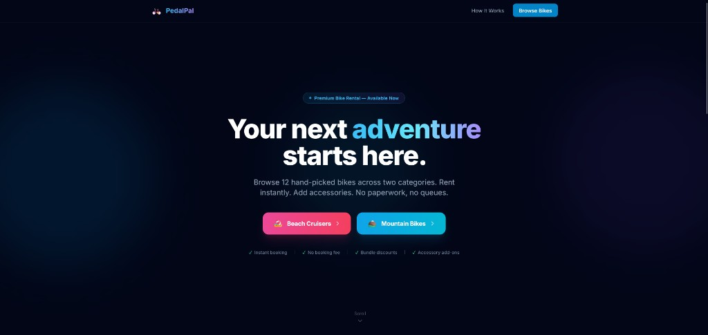
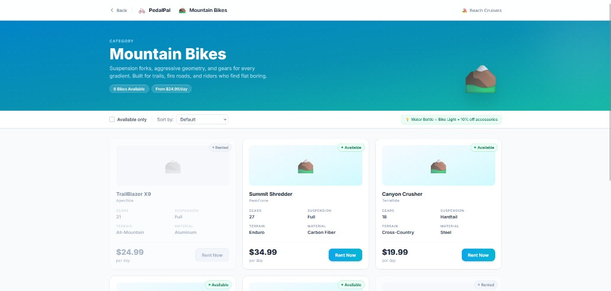
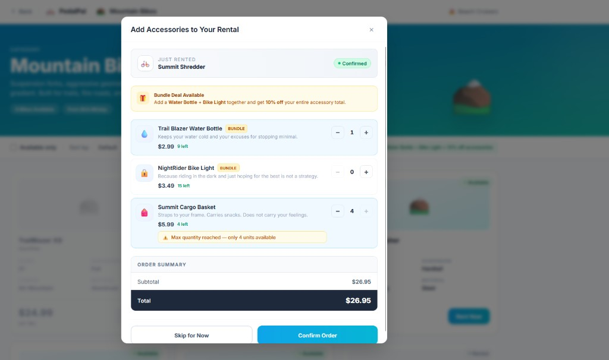
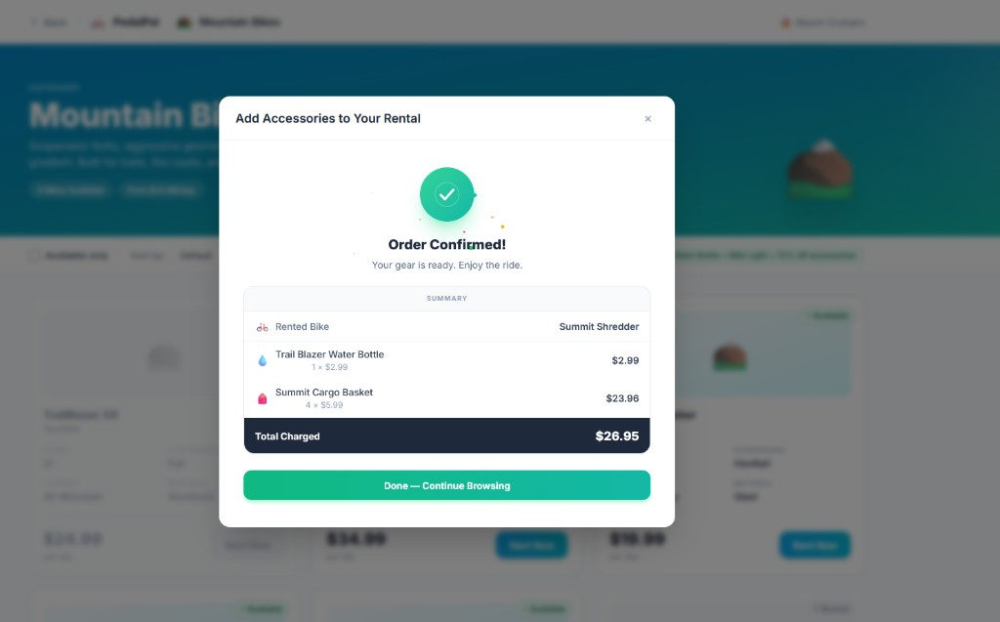
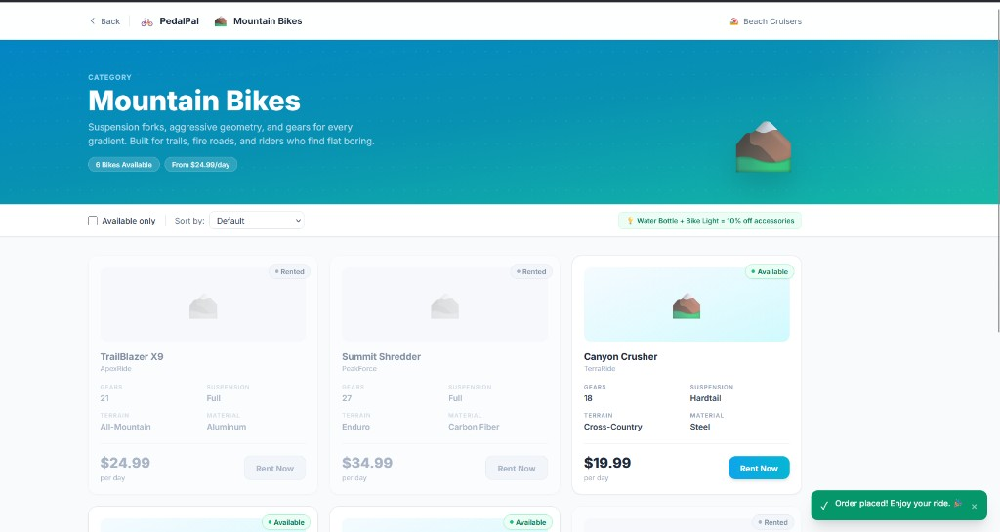
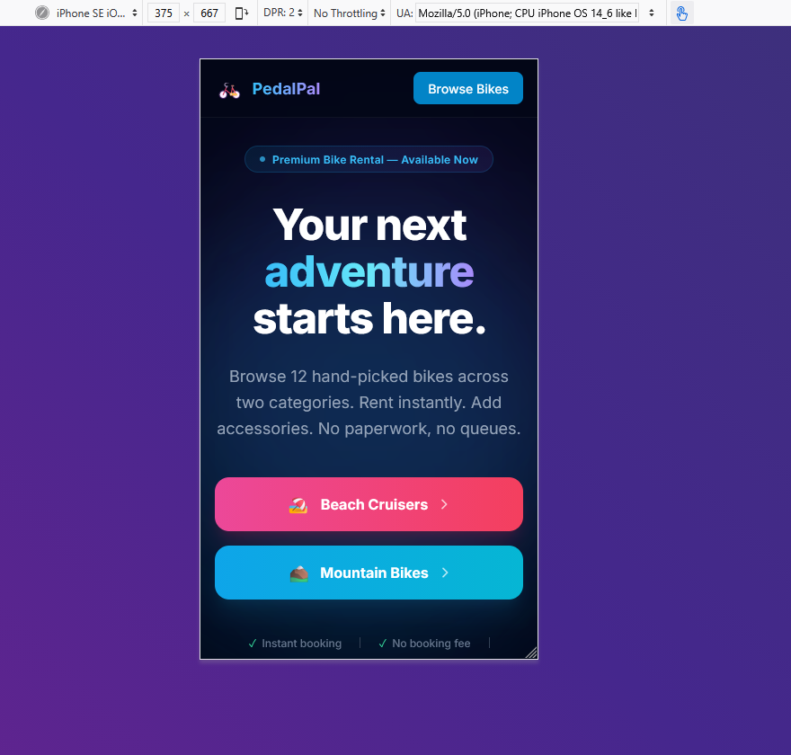
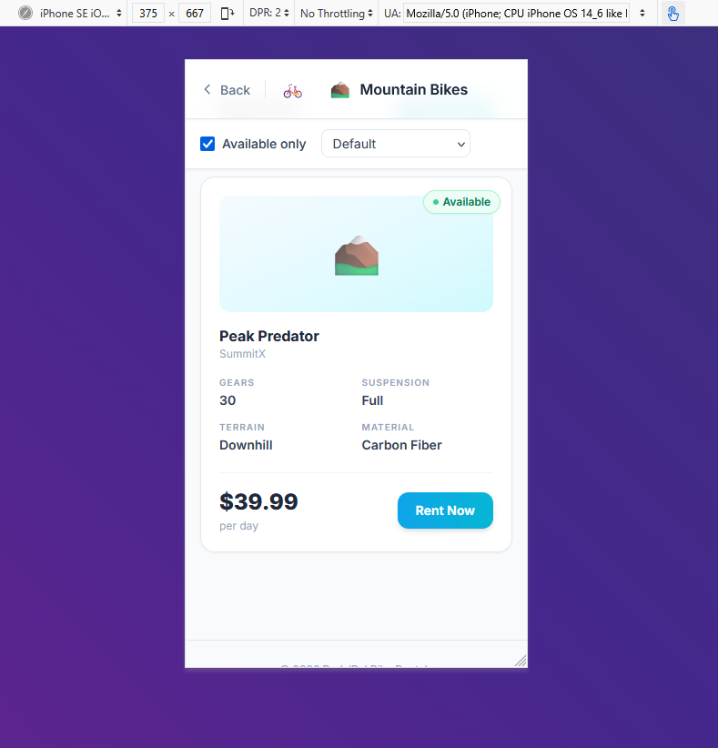

# PedalPal — Bike Rental Web Application

A modernized PHP 7/8 compatible bike rental system featuring a component-based JavaScript frontend, Tailwind CSS UI, and enterprise-grade security, accessibility, and SEO.

---

## Quick Start

**Prerequisites:** PHP 7.4+ and Node.js 14+

```bash
# Start the development server
npm start
# → http://localhost:8080
```

> **Optional:** Run `npm run watch` in a second terminal to auto-bust PHP data caches when XML/JSON data files change.

---

## Screenshots

### Homepage — Desktop



**Features visible:**
- Dark, gradient hero section with animated ambient orbs (decorative, `aria-hidden`)
- Sticky navbar with brand logo, "How It Works" anchor link, and "Browse Bikes" CTA
- Gradient headline with inline colour accent
- Two category CTAs — Beach Cruisers and Mountain Bikes — with hover lift animation
- Trust indicators bar (Instant booking · No booking fee · Bundle discounts · Accessory add-ons)
- Scroll indicator (hidden at larger breakpoints)

---

### Bike Listings — Desktop



**Features visible:**
- Sticky category hero banner with availability count and starting price
- Sticky filter & sort controls bar (Available Only checkbox + Sort By select)
- Bundle deal hint: "Water Bottle + Bike Light = 10% off accessories"
- Responsive 3-column bike card grid (responsive: 1 col mobile → 2 col tablet → 3 col desktop)
- BikeCard components showing: spec grid (Gears, Suspension, Terrain, Material), daily rate, "Rent Now" button
- Availability badges — animated green "Available" pulse and muted "Rented" badge
- Disabled "Rent Now" button with tooltip on rented bikes

---

### Accessory Order Modal — Desktop



**Features visible:**
- Accessible modal overlay with focus trap and Escape-key close
- Rented bike confirmation banner at the top (bike name + "Confirmed" badge)
- Bundle deal alert highlighting the Water Bottle + Bike Light 10% discount
- Accessory list with: category emoji icon, name, description, unit price, stock count
- Quantity stepper (+/−) per item with `role="group"` and per-item ARIA labels
- Inline "Max quantity reached — only N units available" amber warning (live ARIA announcement)
- Real-time Order Summary: subtotal, bundle discount row (when eligible), bold Total
- "Skip for Now" and "Confirm Order" action buttons

---

### Order Confirmed — Desktop



**Features visible:**
- Animated SVG checkmark with stroke-draw animation (respects `prefers-reduced-motion`)
- Confetti burst (28 CSS-animated particles, zero external libraries)
- "Order Confirmed!" heading — focus is moved here automatically for screen readers
- Detailed order summary: Rented Bike row + each selected accessory (name, qty × unit price, line total)
- Bold "Total Charged" row
- "Done — Continue Browsing" button — user controls dismissal, no auto-close

---

### Post-Order State with Toast Notification — Desktop



**Features visible:**
- Modal closed, page returns focus to the bike grid
- Rented bikes immediately show "Rented" badge (optimistic UI update)
- Non-blocking success toast notification: "Order placed! Enjoy your ride. 🎉"
- Toast animates in from bottom-right, auto-dismisses after 4 seconds
- Toast announced via ARIA assertive live region (no visual required for screen readers)

---

## Responsive Design

The application is fully responsive across all screen sizes using Tailwind CSS utility classes with mobile-first breakpoints (`sm:`, `md:`, `lg:`).

### Homepage — Mobile (iPhone SE, 375 × 667)



**Responsive behaviour:**
- Single-column stacked layout on all small screens
- Hero CTAs stack vertically (full-width buttons)
- Navbar collapses — "How It Works" link hidden, only logo and primary CTA visible
- Trust indicators truncate to 2 items per row

---

### Bike Listings — Mobile (iPhone SE, 375 × 667)



**Responsive behaviour:**
- Single-column bike card layout
- Full-width bike card with all specs visible
- Filter bar wraps naturally — checkbox and sort drop-down remain usable at thumb reach
- Available only filter and sort controls remain sticky at top
- "Rent Now" button spans the right side of the card price row

---

```
BikeRentalWeb_php7/
├── index.html                  # Homepage (landing page)
├── beach-cruisers.html         # Beach Cruiser listing page
├── mountain-bikes.html         # Mountain Bike listing page
├── robots.txt                  # Crawler directives
├── sitemap.xml                 # XML sitemap for search engines
├── package.json                # npm scripts (php dev server + watcher)
├── watch.js                    # Cache-busting file watcher
│
├── handlers/                   # PHP API endpoints
│   ├── bike-handler.php        # GET bikes / POST rent
│   ├── accessory-handler.php   # GET accessories / POST order
│   └── _security.php           # Centralised security headers & utilities
│
├── services/                   # PHP business logic layer
│   ├── BeachCruiserService.php
│   ├── MountainBikeService.php
│   └── AccessoryService.php
│
├── data/                       # PHP data / repository layer
│   ├── AbstractFileRepository.php  # SOLID base class (Template Method)
│   ├── BeachCruiserRepository.php
│   ├── MountainBikeRepository.php
│   └── AccessoryRepository.php
│
├── SampleData/                 # XML / JSON data files
│   ├── beach_cruisers.xml
│   ├── mountain_bikes.json
│   └── accessories.json
│
└── js/                         # Frontend component architecture
    ├── core/
    │   ├── Component.js        # Base class: lifecycle, state, helpers
    │   ├── EventBus.js         # Pub/sub for decoupled communication
    │   └── Store.js            # Reactive state container
    ├── services/
    │   └── ApiService.js       # HTTP abstraction with timeout/cancel
    ├── utils/
    │   └── formatters.js       # Pure formatting utilities
    ├── components/             # Presentational components
    │   ├── Toast.js
    │   ├── Modal.js
    │   ├── BikeCard.js
    │   ├── AccessoryItem.js
    │   ├── LoadingSpinner.js
    │   └── SuccessScreen.js
    ├── containers/             # Smart (stateful) components
    │   ├── BikeListContainer.js
    │   └── AccessoryOrderContainer.js
    └── pages/                  # Page bootstrappers
        ├── home.js
        └── bikes.js
```

---

## 1. What Changed and Why

### PHP Backend

| Area | Change | Reason |
|------|--------|--------|
| `AccessoryService.php` | Replaced deprecated `create_function` and `FILTER_SANITIZE_STRING` | PHP 8 compatibility |
| `BeachCruiserRepository.php` | Replaced `each()` loop (removed in PHP 8) with `foreach` | PHP 8 compatibility |
| `AbstractFileRepository.php` *(new)* | Base class centralising cache read/write, `LOCK_EX` file locking, secure `unserialize()` | DRY principle; all repos inherit consistent, safe file I/O |
| `_security.php` *(new)* | Centralised HTTP security headers, `safe_json_decode()`, `json_error()` | Single Responsibility — security concerns in one place |
| `bike-handler.php` | Input validation (`bikeId > 0`, `bikeType` whitelist), security header injection | Prevent invalid requests and injection attacks |
| `accessory-handler.php` | Payload size cap (`MAX_ORDER_ITEMS = 20`), input sanitisation | DoS mitigation |

### Frontend

| Area | Change | Reason |
|------|--------|--------|
| `index.html`, `beach-cruisers.html`, `mountain-bikes.html` | Complete redesign with Tailwind CSS | Modern, responsive, professional UI |
| Component architecture (`js/`) | Replaced jQuery inline scripts with modular ES6 components | Maintainability, testability, reusability |
| `BikeCard.js` | Presentational card with tooltip on disabled state, animated badge | Clear UX communication for unavailable bikes |
| `AccessoryItem.js` | Quantity stepper with stock-limit inline message | Instant feedback when stock ceiling is reached |
| `SuccessScreen.js` | Animated order confirmation, accessory line-item summary, no auto-close | User controls dismissal; full order transparency |
| `Toast.js` | Non-blocking notification system replacing `alert()` | Better UX; non-disruptive feedback |
| `Modal.js` | Accessible overlay with focus trap and Escape key support | Accessible, keyboard-navigable interactions |
| `ApiService.js` | `AbortController` with 15-second timeout | Prevents UI hangs on slow/failed network |

### Security Hardening

- HTTP security headers: `X-Frame-Options`, `X-Content-Type-Options`, `Referrer-Policy`, `X-XSS-Protection`
- PHP Object Injection prevention: `unserialize()` with `allowed_classes => false`
- File write race conditions: `LOCK_EX` on all data file writes
- XSS prevention: `htmlspecialchars()` in PHP, `textContent` / `escape()` in JS
- DoS mitigation: 64 KB request body cap, 20-item order limit

### Accessibility (WCAG 2.1 AA)

- Skip navigation links on all pages
- Dual ARIA live regions in `Toast.js` (polite/assertive)
- `role="group"` + per-item labels on quantity steppers
- `aria-describedby` on disabled Rent buttons linked to tooltip explanation
- `aria-busy` managed during loading; `role="status"` on skeleton loader
- `prefers-reduced-motion` respected in all animations

### SEO

- Unique `<title>` and `<meta name="description">` per page
- Open Graph + Twitter Card tags on all pages
- JSON-LD Schema.org structured data: `LocalBusiness`, `CollectionPage`, `BreadcrumbList`, `ItemList`, `Product`, `Offer`
- `robots.txt` and `sitemap.xml`
- `<link rel="canonical">`, `<link rel="preconnect">`, `<link rel="dns-prefetch">`
- Emoji SVG favicon (eliminates 404 on `/favicon.ico`)

---

## 2. Where and How AI Was Used

AI (Cursor with Claude Sonnet) was used throughout the entire modernisation process as a collaborative engineering partner — not just for code generation, but for architectural thinking, review, and documentation.

| Phase | AI Role |
|-------|---------|
| **Codebase analysis** | Identified deprecated PHP functions, architectural patterns, and security risks across the legacy codebase |
| **Architecture design** | Proposed the Handler → Service → Repository layering, the `AbstractFileRepository` base class, and the smart/presentational component split |
| **Code generation** | Generated component scaffolding, security utilities, ARIA attribute patterns, and JSON-LD schemas |
| **Code review** | Caught nested template literal syntax errors (Firefox `SyntaxError`), double-encoding bugs, and potential XSS vectors |
| **Security audit** | Flagged PHP Object Injection via `unserialize`, silent `@json_decode` failures, missing file locks, and DOM-based XSS |
| **Accessibility audit** | Identified missing ARIA roles, inadequate live regions, and non-descriptive button labels |
| **Documentation** | Structured and wrote `README.md` |

---

## 3. Sample AI Prompts Used

Below are representative prompts that guided the AI collaboration:

```
"Analyse this PHP 7 codebase end-to-end. Identify deprecated functions,
security risks, and architectural improvements needed for PHP 8
compatibility and enterprise-grade quality."
```

```
"Design a reusable component architecture using vanilla JavaScript —
no frameworks. Implement smart/presentational separation with an
EventBus, a reactive Store, and a base Component class."
```

```
"Refactor the three PHP repositories to extend a shared
AbstractFileRepository using the Template Method pattern. Centralise
file locking, cache management, and secure deserialization."
```

```
"Perform a full WCAG 2.1 AA accessibility audit. Add skip links,
ARIA live regions, descriptive button labels, and prefers-reduced-motion
support. Do not break existing functionality."
```

```
"Add comprehensive SEO to all three HTML pages: unique titles,
meta descriptions, Open Graph, Twitter Card, JSON-LD Schema.org
structured data (LocalBusiness, BreadcrumbList, Product), and
resource hints."
```

**General approach:** Prompts were iterative — each response was reviewed, tested in the browser, and refined. When the AI introduced regressions (e.g. Unsplash image CORS errors, nested template literal syntax errors), the issue was described precisely and the AI provided targeted fixes.

---

## 4. Key Assumptions, Trade-offs, and Limitations

### Assumptions

- The application runs on a single server with direct filesystem access (file-based XML/JSON persistence is viable).
- PHP is available on the host — no containerisation required for basic operation.
- A modern browser (Chrome, Firefox, Safari, Edge) is the target; IE is not supported.
- The `localhost:8080` development URL is replaced with a real domain in production (canonical URLs use `pedalpal.example.com` as a placeholder).

### Trade-offs

| Decision | Trade-off |
|----------|-----------|
| Tailwind CSS via CDN (Play CDN) | Fastest setup, zero build step. Not suitable for production at high scale — a compiled CSS file via Tailwind CLI is recommended before deploying. |
| File-based XML/JSON persistence | No database dependency — easy to run locally. Does not scale horizontally (multiple PHP processes would need a shared filesystem or DB). |
| Vanilla JS component architecture | No framework overhead, full control. Requires more boilerplate than React/Vue for complex interactions. |
| `AbstractFileRepository` with PHP serialize cache | Fast repeated reads. Cache must be busted on data change — handled by `watch.js` in development. |
| No authentication/authorisation | Out of scope for this assignment. In production, all rent/order endpoints must be protected. |

### Limitations

- **No real payment processing** — orders are recorded to JSON but no payment gateway is integrated.
- **No user accounts** — rentals are not tied to any user identity.
- **File persistence** — concurrent write contention under very high load is mitigated by `LOCK_EX` but a relational database would be the correct solution at scale.
- **CDN dependency** — Tailwind CSS and Google Fonts require internet access to render correctly.

---

## 5. Integration into a Larger System

This module is designed as a self-contained **Bike Rental micro-frontend** that can be embedded into a larger platform with minimal coupling.

### API Layer

The PHP handlers expose a clean JSON API:

| Endpoint | Method | Description |
|----------|--------|-------------|
| `/handlers/bike-handler.php?action=beach` | `GET` | List beach cruisers |
| `/handlers/bike-handler.php?action=mountain` | `GET` | List mountain bikes |
| `/handlers/bike-handler.php?action=rent` | `POST` | Rent a bike |
| `/handlers/accessory-handler.php?action=getAccessories` | `GET` | List accessories |
| `/handlers/accessory-handler.php?action=orderAccessory` | `POST` | Place accessory order |

These endpoints can be proxied behind an API gateway (e.g. AWS API Gateway, NGINX) and consumed by any frontend or mobile client.

### Replacing File Persistence

Swap the three repository classes (`BeachCruiserRepository`, `MountainBikeRepository`, `AccessoryRepository`) to use PDO/MySQL or any ORM. The `AbstractFileRepository` contract (`getAll()`, `save()`, `loadFromSource()`) remains unchanged — all callers are unaffected (Open/Closed Principle).

### Authentication Integration

Add a middleware check at the top of each handler:

```php
require_once '../auth/middleware.php'; // JWT or session validation
AuthMiddleware::requireRole('customer');
```

The rest of the handler logic is unchanged.

### Deployment Options

| Option | Description |
|--------|-------------|
| **PHP + NGINX** | Use the included `nginx.conf` as a starting point |
| **Docker** | Use the included `docker-compose.yml` |
| **Cloud (AWS/GCP/Azure)** | Package as a container or deploy PHP to App Service / Elastic Beanstalk with an RDS backend |
| **Monorepo** | Drop the `BikeRentalWeb_php7/` folder into any PHP monorepo; update API base URLs in `ApiService.js` |

### Frontend Embedding

The JS modules use standard ES6 `import/export`. They can be:
- Bundled with Webpack/Vite for a larger SPA
- Loaded as native ES modules in any modern HTML host
- Wrapped as Web Components for framework-agnostic embedding

---

## Tech Stack

| Layer | Technology |
|-------|-----------|
| Backend | PHP 7.4+ / 8.x |
| Data | XML (SimpleXML), JSON (file-based) |
| Frontend | Vanilla ES6 JavaScript (no framework) |
| Styling | Tailwind CSS (CDN Play) |
| Typography | Inter (Google Fonts) |
| Dev server | PHP built-in server via `npm start` |

---

## Author

**Swapnil Menkar**
📧 [swapnilmenkar@gmail.com](mailto:swapnilmenkar@gmail.com)
🔗 [linkedin.com/in/swapnil-menkar-7051852b](https://www.linkedin.com/in/swapnil-menkar-7051852b/)
